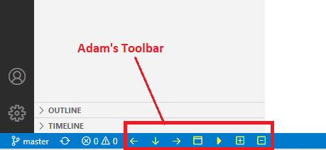

# adamstool README

Adam's Toolbar - Version 0.1.8

The goal of this toolbar extension is to perform some of the common operations using a **single** mouse-click.

## Features

This toolbar adds the following buttons to your Visual Studio Code statusbar.

These buttons will help you view, navigate and debug your source code.

1. Go Back - This will navigate backwards.
2. Go to last cursor location - This will navigate to the last position.
3. Go Forward - This will navigate forward.
4. Open integrated terminal - Will start a new terminal window.
5. Start debugging - Will start debugging session. 
6. Fold all source code - Will collapse the source code.
7. Unfold all source code - Will expand the source code.
8. Match Bracket - Will find the matching bracket.

## Requirements

Built and tested on VS code version 1.58.0

## Extension Settings

No special settings required.

## Known Issues

No known issues.

## Release Notes

Initial Release of AdamsTool.

Version 0.1.8 - Added 'Match Bracket' button. (7/10/2021)

## Toolbar Snapshot

